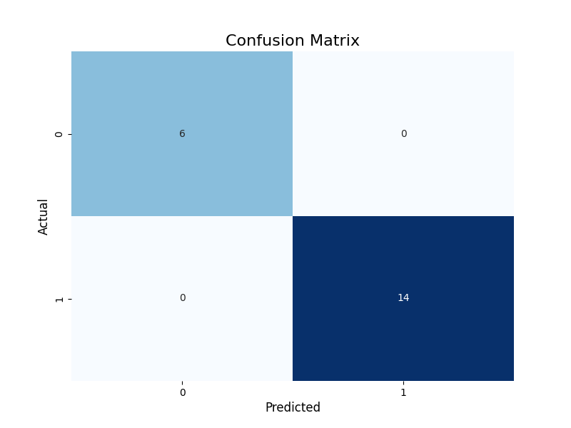

# Supply Chain Optimization Using Machine Learning

**Case Study: Kenya Medical Supplies Authority (KEMSA)**


This project focuses on optimizing supply chain operations at **Kenya Medical Supplies Authority (KEMSA)** through machine learning methodologies. The goal is to forecast medical supply demands using historical data, thereby improving distribution efficiency, minimizing waste, and ensuring optimal medical supply availability across various regions.

### Features

- Demand Forecasting
- Supply Chain Insights
- Data-Driven Decisions

## Usage

To utilize this project, follow these steps to set up the environment and execute the models:

### Installation

1. Clone this repo:

   ```bash
   git clone https://github.com/stevemats/KEMSA-SupplyChain-Optimization.git
   ```

2. Navigate to the project folder:

   ```bash
   cd KEMSA-SupplyChain-Optimization
   ```

3. Install the required project libraries:

   ```bash
   pip install -r requirements.txt
   ```

---

<i>Data Flow Diagram (DFD) generation (Optional)</i>:

```bash
py dfdGen.py
```

Output will be saved in the images section unless defined otherwise

```python
...
if not os.path.exists('images'):
   os.makedirs('images')
...
dfd.render('images/KEMSA_Supply_Chain_DFD', format='png', cleanup=False)
```

<i>CSV Data Sample Used</i>

```csv
Region,Month,Supply_Category,Demand_Quantity,Delivery_Time_Days,Stock_Level,Restock_Flag
Nairobi,January,Medicine,120,5,300,0
Baringo,February,Medicine,140,4,250,0
```

## Headers:

1. Region - Geographic area for distribution. Includes major regions like Nairobi, Mombasa, Kisumu, Eldoret, and Nakuru.
2. Month - Month of data recording, covering January through December to track seasonal variations.
3. Supply_Category - The type of medical supply being tracked. Categories include:
   - Medicine: General medication needed in healthcare facilities.
   - PPE: Personal protective equipment such as gloves, masks, etc.
   - Surgical Equipment: Specialized medical tools and equipment used in surgeries.

- Different categories have unique demand patterns and logistical requirements.

4. Demand_Quantity - Quantity of supplies required.
5. Restock_Flag - A binary indicator (0 or 1) used to signal whether restocking is needed:
   0: No restock required (stock level is sufficient for the near future).
   1: Restocking is required due to low stock levels o increased demand.
6. Delivery_Time_Days - The number of days taken for the supplies to be delivered to the healthcare facilities. Delivery times can vary due to logistics, road conditions, or inventory issues, and can range from 2 to 7 days in this dataset.
7. Stock_Level - The number of items left in stock after the demand has been met for that region and month. This helps in tracking stock consumption and is critical for understanding when restocking is needed. A higher stock level means the region has enough supplies, while a lower stock level indicates potential shortages.

---

### Model Evaluation Metrics

```bash
Model Accuracy: 100.00%

Confusion Matrix:
[[ 6  0]
 [ 0 14]]

Classification Report:
              precision    recall  f1-score   support

         0.0       1.00      1.00      1.00         6
         1.0       1.00      1.00      1.00        14

    accuracy                           1.00        20
   macro avg       1.00      1.00      1.00        20
weighted avg       1.00      1.00      1.00        20
```




---

DISCLAIMER!

> This project is built for educational purposes and may require further modifications before being used in real-world scenarios.
