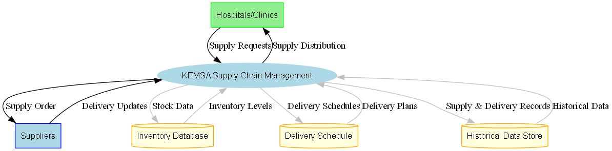

# Supply Chain Optimization using Machine Learning

Case Study: **KEMSA**


The **Kenya Medical Supplies Authority (KEMSA)** is a specialized government agency responsible for procuring, storing, and distributing medical supplies and pharmaceuticals to public health facilities across Kenya. As the backbone of Kenya’s healthcare supply chain, KEMSA ensures that essential medicines, medical equipment, and health commodities reach every corner of the country efficiently and in a timely manner. The organization plays a critical role in maintaining the integrity of the healthcare supply chain, from managing complex logistics networks to ensuring the availability of critical health supplies during emergencies.

Given the vast geographical coverage and the high demand for medical supplies, KEMSA’s supply chain faces numerous challenges, including fluctuating demand, logistical delays, and the risk of overstocking or understocking in regional facilities. By leveraging data-driven approaches and modern technology like machine learning, there is significant potential to optimize these processes, leading to more efficient distribution, minimized waste, and improved healthcare outcomes.

---

## Project Overview



This project aims to optimize the supply chain operations at the **Kenya Medical Supplies Authority (KEMSA)** by leveraging machine learning techniques. The system will predict medical supply demands based on historical data, with the ultimate goal of reducing waste, improving delivery efficiency, and ensuring optimal distribution of medical supplies across various regions.

## Key Objectives

- **Predictive Analytics**: Develop a machine learning model to forecast medical supply needs for different regions in Kenya, based on historical consumption and distribution patterns.
- **Delivery Insights**: Provide insights into delivery times and optimal replenishment schedules, helping to streamline logistics and reduce delays.
- **Stock Optimization**: Enhance stock management by predicting demand, reducing overstock or understock scenarios, and ensuring timely replenishment of essential medical supplies.

## Features

- **Demand Forecasting**: Predict medical supply demand by region using machine learning algorithms.
- **Supply Chain Insights**: Analyze delivery times and provide recommendations to improve stock replenishment and reduce logistical delays.
- **Data-Driven Decisions**: Leverage historical data to make informed decisions regarding the distribution of medical supplies.

## Tech Layout: Prerequisitess

- **Python**: The core language for data processing and machine learning.
- **Scikit-learn**: For building and evaluating predictive models.
- **TensorFlow/Keras**: For developing deep learning models, if necessary, for complex data patterns.
- **Pandas & NumPy**: For data manipulation and analysis.
- **Matplotlib/Seaborn**: For data visualization and reporting.

> All required libraries will be available under `requirements.txt` file(refer to usage section) as the projects progresses.

## Project Structure

1. **Data Collection & Preparation**: Gather historical data on medical supply distribution, demand patterns, and regional factors.
2. **Data Cleaning & Exploration**: Clean and explore the dataset to gain insights and ensure it’s ready for modeling.
3. **Model Development**: Build predictive models using machine learning to forecast supply demands.
4. **Model Evaluation**: Test and evaluate model performance to ensure accurate predictions.
5. **Insights & Optimization**: Generate reports and visualizations to provide actionable insights for stock replenishment and delivery improvements.
6. **Deployment**: Package the model for deployment and integration.

## Usage

To use this project, follow the instructions for setting up the environment and running the models.

## Installation

1. Clone this repository:
   ```bash
   git clone https://github.com/your-username/KEMSA-SupplyChain-Optimization.git
   ```
2. Navigate to the project directory:

   ```bash
   cd KEMSA-SupplyChain-Optimization
   ```

3. Install the required Python libraries:

   ```bash
   pip install -r requirements.txt
   ```

## Contribution

---

<i>DFD generation (Not a must for the project)</i>:

```bash
py dfdGen.py
```

Output will be saved in the images section unless destination is altered to a different location

```python
...
if not os.path.exists('images'):
   os.makedirs('images')
...
dfd.render('images/KEMSA_Supply_Chain_DFD', format='png', cleanup=False)
```

<i>CSV Data</i>

```csv
Region,Month,Supply_Category,Demand_Quantity,Delivery_Time_Days,Stock_Level,Restock_Flag
Nairobi,January,Medicine,120,5,300,0
Baringo,February,Medicine,140,4,250,0
```

## Headers:

1. Region - The geographic location where the medical supplies are distributed. This includes major regions such as Nairobi, Mombasa, Kisumu, Eldoret, and Nakuru. Each region represents a distinct market with unique supply chain needs and logistics.
2. Month - Refers to the month of the year in which the supply data was recorded. The dataset spans January to December, allowing us to track monthly variations in demand, delivery times, and stock levels over a full year.
3. Supply_Category - The type of medical supply being tracked. Categories include:
   - Medicine: General medication needed in healthcare facilities.
   - PPE: Personal protective equipment such as gloves, masks, etc.
   - Surgical Equipment: Specialized medical tools and equipment used in surgeries.

- Different categories have unique demand patterns and logistical requirements.

4. Demand_Quantity -

---

---

DISCLAIMER!

> This project is built for educational purposes and may require further modifications before being used in real-world scenarios.
